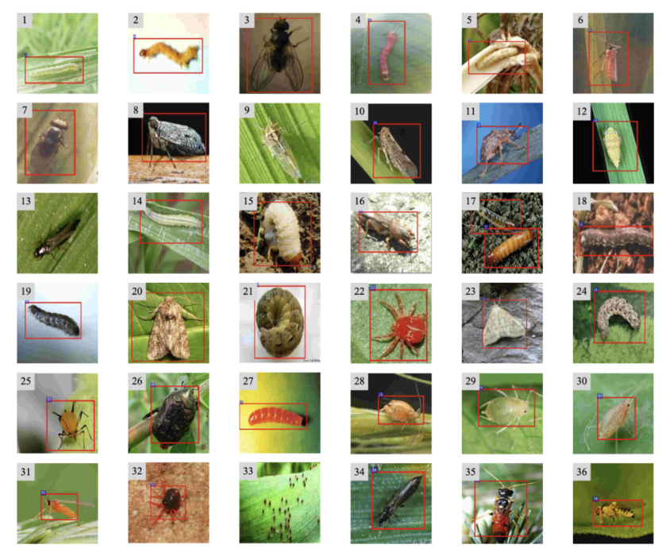
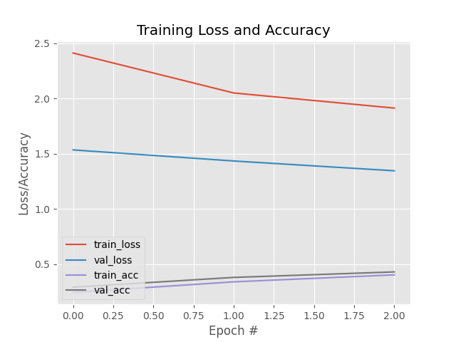
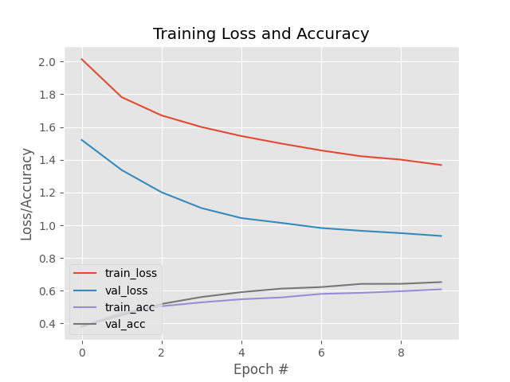
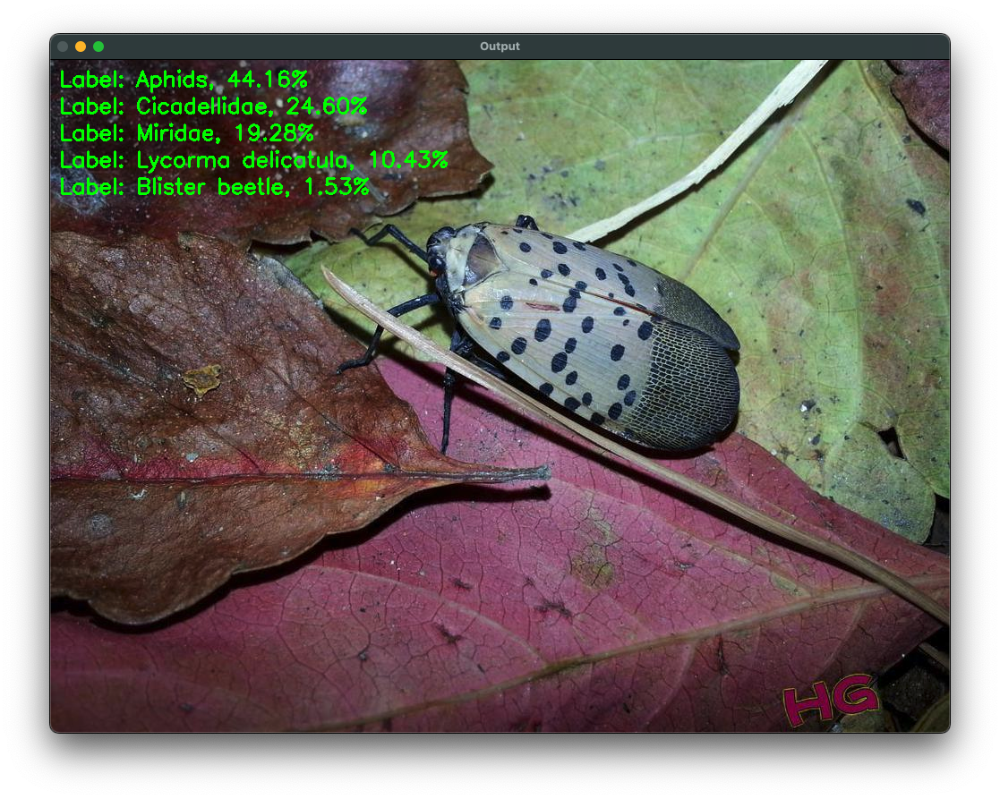
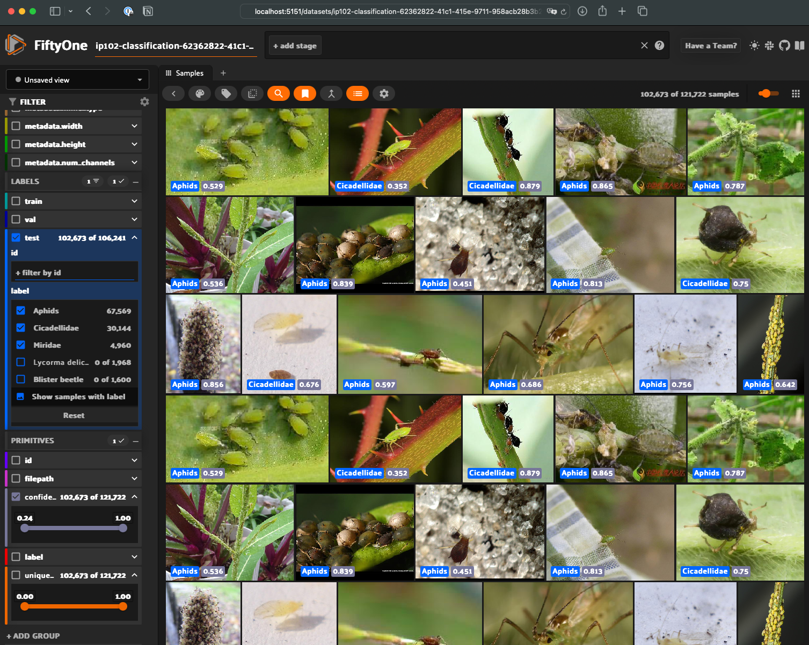
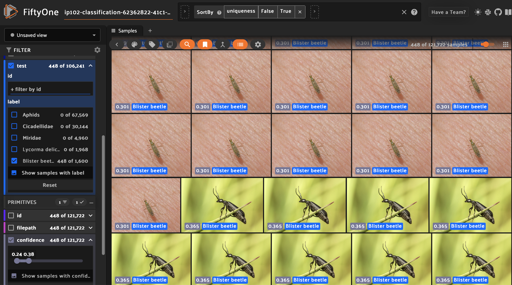

# Voxel51 Project Interview -- Insect Classification

## Inspiration - Insect Classification


Sometimes you find bugs in your *code*.  Other times you find bugs in your *hotel room* or *AirBnB*...

I trained (finetuned) an insect classifier using a subset of the **IP102 Insects Dataset**.  

Furthermore, I learned a few fundamentals of the **FiftyOne** API and application to explore the dataset as I had never used FO before.


## Agenda

1. **Dataset**
   * Review the structure of the IP102 Insects Dataset
   * Review `config.py` settings
   * Review `prepare_dataset.py` and its output
   * *see section 4 for exploring the dataset with FiftyOne*
2. **Training**
   * Review `finetune.py` and its output
3. **Inference**
   * Review & execute `classify_image.py` on a few examples
4. **FiftyOne**
   * Review `fo_load_dataset.py`
   * Review `fo_load_dataset_w_confidence_batch.py`

## 1. Dataset



Review dataset settings in `config.py`.

Dataset directory prior to executing `prepare_dataset.py`:

```commandline
% cd dataset
% tree -L 5 --dirsfirst --filelimit 10
.
├── ip102_v1.1
│   ├── images  [75222 entries exceeds filelimit, not opening dir]
│   ├── test.txt
│   ├── test_df.csv
│   ├── train.txt
│   ├── train_df.csv
│   ├── val.txt
│   └── valid_df.csv
├── Classification-20240328T174120Z-001.zip
├── Detection-20240328T174147Z-001.zip
└── ip102_v1.1-002.tar

3 directories, 9 files
```

Review `.txt` and `.csv` files of interest.

Execute the `prepare_dataset.py` script:

```commandline
% cd ..
% python prepare_dataset.py 
2024-04-03 21:03:23,533 - INFO - loading data files...
2024-04-03 21:03:23,585 - INFO - preparing data frames...
2024-04-03 21:03:23,591 - INFO - processing 'training split'...
2024-04-03 21:03:37,420 - INFO - processing 'testing split'...
2024-04-03 21:03:43,776 - INFO - processing 'validation split'...
2024-04-03 21:03:45,791 - INFO - serializing data frames...
2024-04-03 21:03:45,829 - INFO - Images are split according to the 
following percentages
2024-04-03 21:03:45,829 - INFO - Training [60]
2024-04-03 21:03:45,829 - INFO - Testing [30]
2024-04-03 21:03:45,829 - INFO - Validation [10]

Process finished with exit code 0
```

Dataset directory after running `prepare_dataset.py` demonstrates that images from the dataset are sorted into training, validation, and testing directories.

```commandline
% cd dataset
% tree -L 5 --dirsfirst --filelimit 10
.
├── ip102_v1.1
│   ├── data
│   │   ├── testing
│   │   │   ├── 102  [1723 entries exceeds filelimit, not opening dir]
│   │   │   ├── 25  [1229 entries exceeds filelimit, not opening dir]
│   │   │   ├── 52  [570 entries exceeds filelimit, not opening dir]
│   │   │   ├── 68  [1594 entries exceeds filelimit, not opening dir]
│   │   │   └── 71  [1525 entries exceeds filelimit, not opening dir]
│   │   ├── training
│   │   │   ├── 102  [3444 entries exceeds filelimit, not opening dir]
│   │   │   ├── 25  [2456 entries exceeds filelimit, not opening dir]
│   │   │   ├── 52  [1138 entries exceeds filelimit, not opening dir]
│   │   │   ├── 68  [3186 entries exceeds filelimit, not opening dir]
│   │   │   └── 71  [3048 entries exceeds filelimit, not opening dir]
│   │   └── validation
│   │       ├── 102  [573 entries exceeds filelimit, not opening dir]
│   │       ├── 25  [409 entries exceeds filelimit, not opening dir]
│   │       ├── 52  [189 entries exceeds filelimit, not opening dir]
│   │       ├── 68  [530 entries exceeds filelimit, not opening dir]
│   │       └── 71  [508 entries exceeds filelimit, not opening dir]
│   ├── images  [75222 entries exceeds filelimit, not opening dir]
│   ├── test.txt
│   ├── test_df.csv
│   ├── train.txt
│   ├── train_df.csv
│   ├── val.txt
│   └── valid_df.csv
├── Classification-20240328T174120Z-001.zip
├── Detection-20240328T174147Z-001.zip
└── ip102_v1.1-002.tar

22 directories, 9 files
```

## 2. Training

Here we will finetune -- meaning use a pretrained model preserving the model structure and weights except for the "head" of the network in which we replace with a fully-connected softmax classifier layer.  We use the MobileNetV2 classifier pretrained on the ImageNet dataset.   This effectively gives us a great starting point and saves a lot of time.

A couple techniques employed to reduce overfitting include:

* data augmentation - random flips, shears, zooms, and rotations of the dataset to effectively create more images for training
* dropout - randomly dropping out (setting to zero) a proportion of neurons during training

Review `finetune.py`.

Upon executing `finetune.py` we'll have the following output:

```commandline
finetune.py
Found 13272 images belonging to 5 classes.
Found 2209 images belonging to 5 classes.
Found 6641 images belonging to 5 classes.
[INFO] compiling model...
[INFO] training network...
Epoch 1/3
414/414 [==============================] - 391s 944ms/step - loss: 2.4130 - 
accuracy: 0.2426 - val_loss: 1.5346 - val_accuracy: 0.2899
Epoch 2/3
414/414 [==============================] - 397s 960ms/step - loss: 2.0509 - 
accuracy: 0.3384 - val_loss: 1.4342 - val_accuracy: 0.3786
Epoch 3/3
414/414 [==============================] - 388s 938ms/step - loss: 1.9137 - 
accuracy: 0.4016 - val_loss: 1.3453 - val_accuracy: 0.4284
[INFO] evaluating after fine-tuning network head...
                    precision    recall  f1-score   support

      Cicadellidae       0.48      0.69      0.57      1723
            aphids       0.28      0.60      0.38      1229
    blister beetle       0.47      0.01      0.02       570
Lycorma delicatula       0.59      0.39      0.47      1594
           Miridae       0.55      0.14      0.22      1525

          accuracy                           0.42      6641
         macro avg       0.47      0.37      0.33      6641
      weighted avg       0.48      0.42      0.38      6641

...

[INFO] re-compiling model...
Epoch 1/10
414/414 [==============================] - 557s 1s/step - loss: 2.0141 - 
accuracy: 0.3807 - val_loss: 1.5210 - val_accuracy: 0.3822
Epoch 2/10
414/414 [==============================] - 734s 2s/step - loss: 1.7823 - 
accuracy: 0.4645 - val_loss: 1.3373 - val_accuracy: 0.4511
Epoch 3/10
414/414 [==============================] - 605s 1s/step - loss: 1.6707 - 
accuracy: 0.5054 - val_loss: 1.2013 - val_accuracy: 0.5190
Epoch 4/10
414/414 [==============================] - 675s 2s/step - loss: 1.5999 - 
accuracy: 0.5289 - val_loss: 1.1047 - val_accuracy: 0.5616
Epoch 5/10
414/414 [==============================] - 644s 2s/step - loss: 1.5447 - 
accuracy: 0.5480 - val_loss: 1.0435 - val_accuracy: 0.5915
Epoch 6/10
414/414 [==============================] - 629s 2s/step - loss: 1.4989 - 
accuracy: 0.5590 - val_loss: 1.0143 - val_accuracy: 0.6128
Epoch 7/10
414/414 [==============================] - 591s 1s/step - loss: 1.4568 - 
accuracy: 0.5806 - val_loss: 0.9831 - val_accuracy: 0.6223
Epoch 8/10
414/414 [==============================] - 639s 2s/step - loss: 1.4213 - 
accuracy: 0.5870 - val_loss: 0.9660 - val_accuracy: 0.6418
Epoch 9/10
414/414 [==============================] - 912s 2s/step - loss: 1.4005 - 
accuracy: 0.5971 - val_loss: 0.9516 - val_accuracy: 0.6422
Epoch 10/10
414/414 [==============================] - 554s 1s/step - loss: 1.3682 - 
accuracy: 0.6085 - val_loss: 0.9345 - val_accuracy: 0.6526
[INFO] evaluating after fine-tuning network...
                    precision    recall  f1-score   support

      Cicadellidae       0.72      0.75      0.74      1723
            aphids       0.51      0.68      0.58      1229
    blister beetle       0.56      0.36      0.44       570
Lycorma delicatula       0.71      0.68      0.69      1594
           Miridae       0.64      0.54      0.59      1525

          accuracy                           0.64      6641
         macro avg       0.63      0.60      0.61      6641
      weighted avg       0.65      0.64      0.64      6641

[INFO] serializing network...

Process finished with exit code 0
```

The associated "warmup" (i.e. Epochs 1-3) training plot is as follows:



Followed by the full fine-tuning result plot over 10 Epochs:



## 3. Inference

Running `classify_image.py` on the sample images yields the followowing:

```commandline
% python classify_image.py --model model/insect_pest_model.h5 \
--image sample_data/68.png 
2024-04-03 21:42:04,364 - INFO - parsing command line arguments
2024-04-03 21:42:04,364 - INFO - loading the model...
2024-04-03 21:42:04.606211: I tensorflow/core/platform/cpu_feature_guard.cc:142] 
This TensorFlow binary is optimized with oneAPI Deep Neural Network Library
(oneDNN)to use the following CPU instructions in performance-critical 
operations:  AVX2 FMA
To enable them in other operations, rebuild TensorFlow with the appropriate 
compiler flags.
2024-04-03 21:42:04.625168: I tensorflow/compiler/xla/service/service.cc:168] 
XLA service 0x7fa5d5777e70 initialized for platform Host (this does not 
guarantee that XLA will be used). Devices:
2024-04-03 21:42:04.625181: I tensorflow/compiler/xla/service/service.cc:176]
StreamExecutor device (0): Host, Default Version
2024-04-03 21:42:05,620 - INFO - loading the image
2024-04-03 21:42:05,628 - INFO - preprocessing - swapping color channels and 
resizing
2024-04-03 21:42:05,633 - INFO - preprocessing - adding a batch dimension, 
convering to float32, and conducting mean subtraction
2024-04-03 21:42:05,634 - INFO - making a prediction
2024-04-03 21:42:06,216 - INFO - classification took 0.5826 seconds...
2024-04-03 21:42:06,216 - INFO - analyzing results
2024-04-03 21:42:06,217 - INFO - Top-5 results:
2024-04-03 21:42:06,217 - INFO - RESULT 1. Label: Aphids, 44.16%
2024-04-03 21:42:06,217 - INFO - RESULT 2. Label: Cicadellidae, 24.60%
2024-04-03 21:42:06,217 - INFO - RESULT 3. Label: Miridae, 19.28%
2024-04-03 21:42:06,217 - INFO - RESULT 4. Label: Lycorma delicatula, 10.43%
2024-04-03 21:42:06,217 - INFO - RESULT 5. Label: Blister beetle, 1.53%

Process finished with exit code 0
```



## 4. FiftyOne

I wanted to use this as an opportunity to learn a few basics of the FiftyOne app.  I was able to accomplish the following by reading the docs and looking at samples:

* Load the dataset into FiftyOne
* Add a custom field for "confidence" to the FiftyOne dataset
* Compute uniqueness and sort images by uniqueness (to explore the data augmentation images



```commandline
2024-04-03 21:52:35,010 - INFO - loading the model...
2024-04-03 21:52:35.312589: I tensorflow/core/platform/cpu_feature_guard.cc:142] 
This TensorFlow binary is optimized with oneAPI Deep Neural Network Library 
(oneDNN)to use the following CPU instructions in performance-critical 
operations:  AVX2 FMA
To enable them in other operations, rebuild TensorFlow with the appropriate 
compiler flags.
2024-04-03 21:52:35.331252: I tensorflow/compiler/xla/service/service.cc:168] 
XLA service 0x7fc93d95c3c0 initialized for platform Host (this does not 
guarantee that XLA will be used). Devices:
2024-04-03 21:52:35.331270: I tensorflow/compiler/xla/service/service.cc:176]
StreamExecutor device (0): Host, Default Version
2024-04-03 21:52:36,277 - INFO - reading label txt files
2024-04-03 21:52:36,317 - INFO - creating annotation dictionaries
2024-04-03 21:52:36,367 - INFO - remapping integer labels to string labels 
from the config
2024-04-03 21:52:36,378 - INFO - creating the FiftyOne dataset
2024-04-03 21:52:36,436 - INFO - adding FiftyOne dataset samples
2024-04-03 21:52:36,446 - INFO - train - processed batch 1 of 829
2024-04-03 21:52:36,448 - INFO - train - processed batch 2 of 829
2024-04-03 21:52:36,451 - INFO - train - processed batch 3 of 829
...
2024-04-03 21:52:39,277 - INFO - train - processed batch 827 of 829
2024-04-03 21:52:39,281 - INFO - train - processed batch 828 of 829
2024-04-03 21:52:39,283 - INFO - train - processed batch 829 of 829
2024-04-03 21:52:39,288 - INFO - val - processed batch 1 of 138
2024-04-03 21:52:39,291 - INFO - val - processed batch 2 of 138
2024-04-03 21:52:39,294 - INFO - val - processed batch 3 of 138
...
2024-04-03 21:52:39,697 - INFO - val - processed batch 136 of 138
2024-04-03 21:52:39,700 - INFO - val - processed batch 137 of 138
2024-04-03 21:52:39,703 - INFO - val - processed batch 138 of 138
2024-04-03 21:52:47,678 - INFO - test - processed batch 1 of 415
2024-04-03 21:52:54,547 - INFO - test - processed batch 2 of 415
2024-04-03 21:53:01,416 - INFO - test - processed batch 3 of 415
...
2024-04-03 22:39:14,950 - INFO - test - processed batch 413 of 415
2024-04-03 22:39:21,656 - INFO - test - processed batch 414 of 415
2024-04-03 22:39:27,654 - INFO - test - processed batch 415 of 415
 100% |█| 121722/121722 [28.9s elapsed, 0s remaining, 5.2K samples/s]      
2024-04-03 22:39:57,047 - INFO -  100% |█| 121722/121722 [28.9s elapsed, 
0s remaining, 5.2K samples/s]      
2024-04-03 22:40:01,710 - INFO - Computing embeddings...
Computing embeddings...
 100% |█| 121722/121722 [38.5m elapsed, 0s remaining, 40.4 samples/s]      
2024-04-03 23:18:34,633 - INFO -  100% |█| 121722/121722 [38.5m elapsed, 
0s remaining, 40.4 samples/s]      
Computing uniqueness...
Computing neighbors for 121722 embeddings; this may take awhile...
2024-04-03 23:18:36,339 - INFO - Computing uniqueness...
2024-04-03 23:18:36,339 - INFO - Computing neighbors for 121722 embeddings; 
this may take awhile...
/Users/drhoffma/PycharmProjects/v51/venv/lib/python3.8/site-packages/
threadpoolctl.py:1223: RuntimeWarning: 
Found Intel OpenMP ('libiomp') and LLVM OpenMP ('libomp') loaded at
the same time. Both libraries are known to be incompatible and this
can cause random crashes or deadlocks on Linux when loaded in the
same Python program.
Using threadpoolctl may cause crashes or deadlocks. For more
information and possible workarounds, please see
    https://github.com/joblib/threadpoolctl/blob/master/multiple_openmp.md

  warnings.warn(msg, RuntimeWarning)
Uniqueness computation complete
2024-04-03 23:28:11,676 - INFO - Uniqueness computation complete
2024-04-03 23:28:11,955 - INFO - launching FiftyOne!
2024-04-03 23:29:36,796 - INFO - App launched. Point your web browser to 
http://localhost:5151
App launched. Point your web browser to http://localhost:5151
```



---

**Resources**

* Xiaoping Wu et al. “IP102: A Large-Scale Benchmark Dataset for Insect Pest Recognition”. In: IEEE CVPR. 2019, pages 8787–8796.
* Voxel 51 Docs. Available: https://docs.voxel51.com
* Hoffman, D., Rosebrock, A., McDuffee, D., Thanki, A. Paul, S. "Raspberry Pi for Computer Vision". Chapters 19-20.
